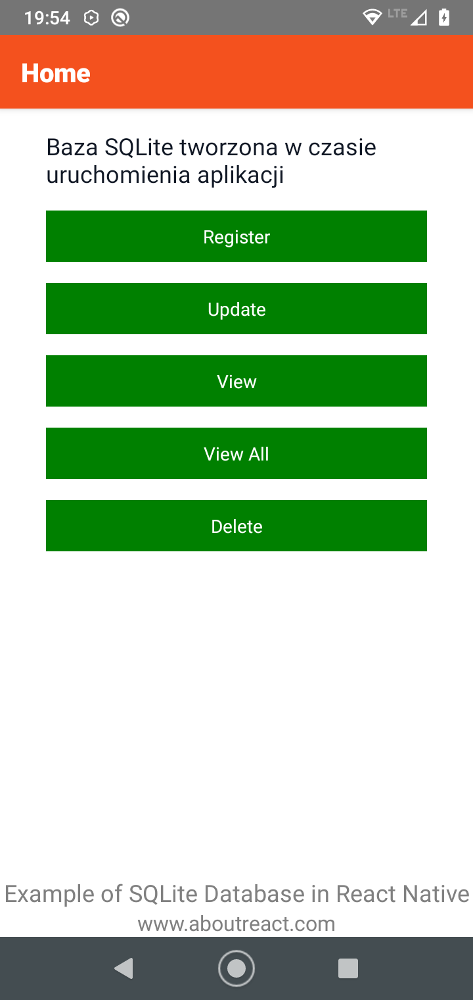

### Tworzenie projektu od zera
Należy zwrócić uwagę na wersję React-Native, dla której tworzymy projekt:  
```npx react-native init SQLite --version 0.63.4```  
Dla ww. wersji RN udaje się zainstalować wymagane pakiety, dla nowszych już nie!  

### Instalacja pakietów (gdy korzystamy z gotowego projektu na repo):  
``` npm install```  

### Wygląd aplikacji  
  
